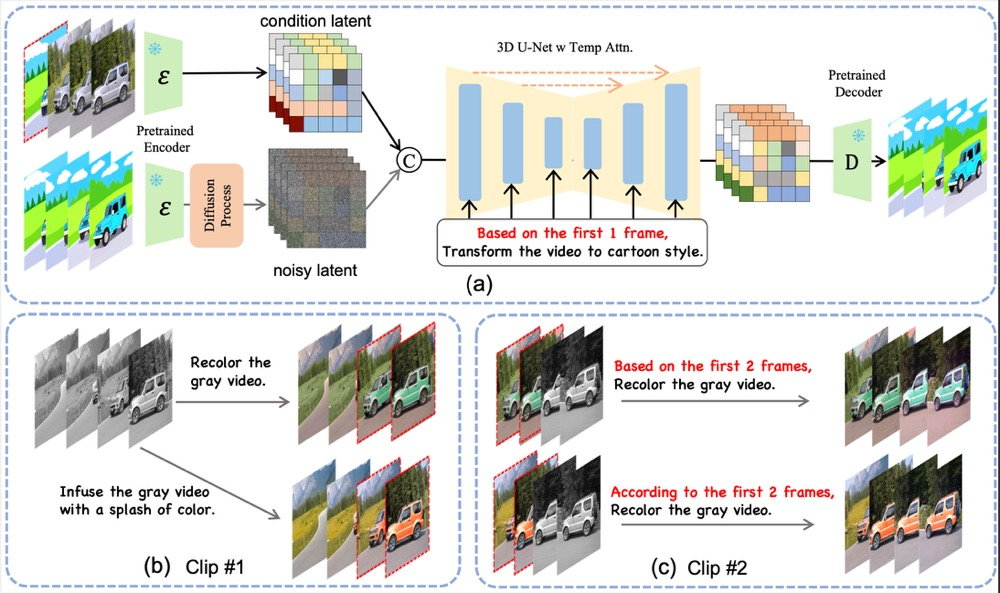

# VIDiff

This repository is the official implementation of **VIDiff: Translating Videos via Multi-Modal Instructions with Diffusion Models**.

**[VIDiff: Translating Videos via Multi-Modal Instructions with Diffusion Models](https://arxiv.org/abs/2311.18837)**
<br/>
[Zhen Xing](https://chenhsing.github.io/) , [Qi Dai](https://scholar.google.com/citations?user=NSJY12IAAAAJ), Zihao Zhang, Hui Zhang, [Han Hu](https://ancientmooner.github.io/), [Zuxuan Wu](https://zxwu.azurewebsites.net/), [Yu-Gang Jiang](https://scholar.google.com/citations?user=f3_FP8AAAAAJ&hl=zh-CN)
<br/>

[](https://opensource.org/licenses/Apache-2.0) [](https://chenhsing.github.io/VIDiff/) [](https://arxiv.org/abs/2311.18837)

<p align="center">
  
<br>
<em>VIDiff: Translating Videos via Multi-Modal Instructions with Diffusion Models.</em>
</p>


## Abstract
> Diffusion models have achieved significant success in image and video generation. This motivates a growing interest in video editing tasks, where videos are edited according to provided text descriptions. However, most existing approaches only focus on video editing for short clips and rely on time-consuming tuning or inference. We
are the first to propose Video Instruction Diffusion (VIDiff), a unified foundation model designed for a wide range of video tasks. These tasks encompass both understanding tasks (such as language-guided video object segmentation) and generative tasks (video editing and enhancement). Our model can edit and translate the desired results
within seconds based on user instructions. Moreover, we design an iterative auto-regressive method to ensure consistency in editing and enhancing long videos. We provide convincing generative results for diverse input videos and written instructions, both qualitatively and quantitatively.

## Contact
If you have any suggestions or find our work helpful, feel free to contact us

Homepage: [Zhen Xing](https://chenhsing.github.io)

Email: zhenxingfd@gmail.com


If you find our work useful, please consider citing it:

```
@article{VIDiff,
  title={VIDiff: Translating Videos via Multi-Modal Instructions with Diffusion Models},
  author={Zhen Xing and Qi Dai and Zihao Zhang and Hui Zhang and Han Hu and Zuxuan Wu and Yu-Gang Jiang}, 
  journal={arXiv preprint arXiv:2311.18837},
  year={2023}
}
```
